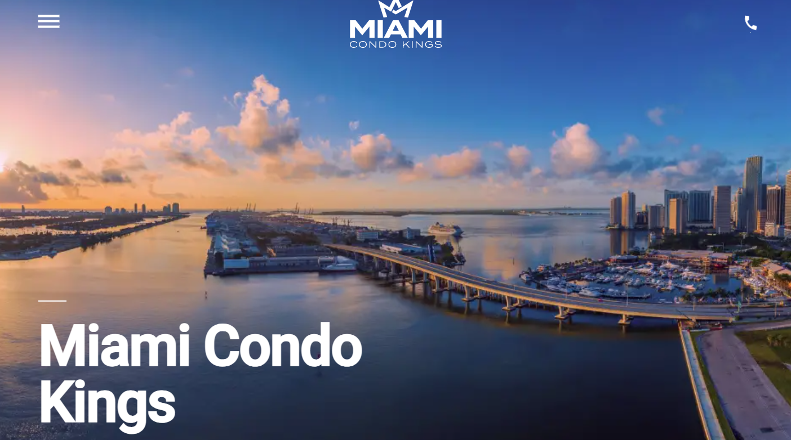

🎨 Responsive Layout with Animations

  

This project showcases a responsive layout with animations built purely using HTML, CSS, and JavaScript. The layout adjusts seamlessly across all devices, and elements animate into view as users scroll through the page.

🔗 Live Demo: [Your GitHub Pages Link](https://alexsand-r.github.io/miami/home.html)

🚀 Features
✅ Responsive Design: Adapts perfectly across mobile, tablet, and desktop screens.
✅ Smooth Animations: Elements animate into view as you scroll down the page, enhancing user interaction.
✅ Dynamic Interactions: JavaScript handles animations and element transitions, making the page interactive.

🛠️ Technologies Used
HTML – For building the structure of the web pages.
CSS – For styling the application and creating responsive layouts using Flexbox and Grid.
JavaScript – For managing animations and interactivity, including triggering element visibility as the user scrolls.

📫 Contact Me:
1inboxna@gmail.com
